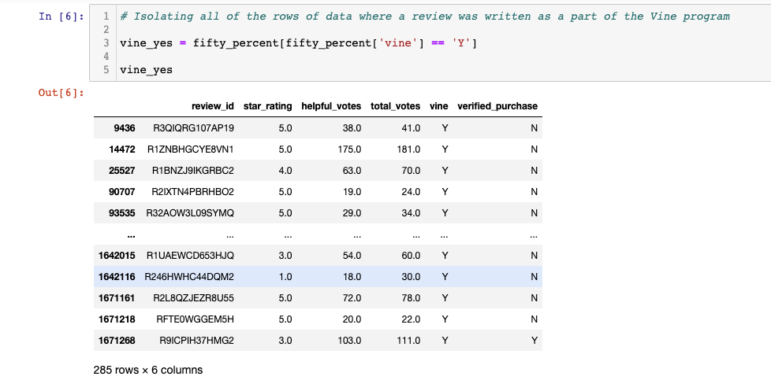
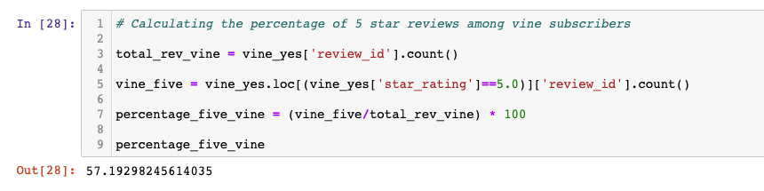
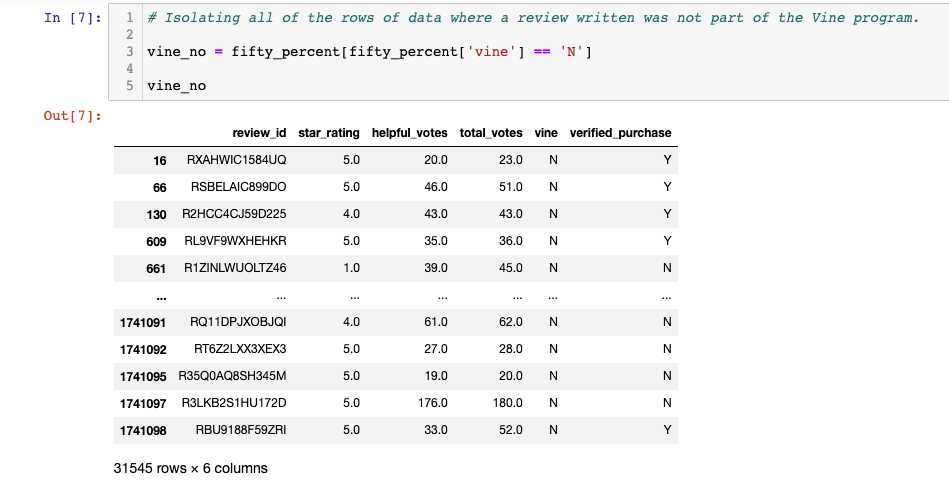
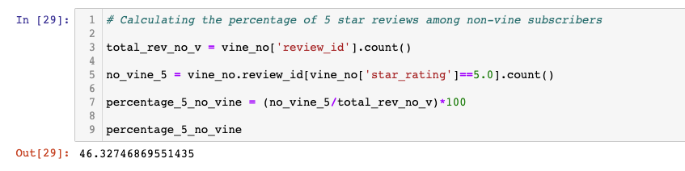
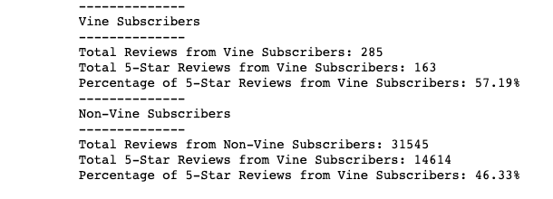

# Amazon_Vine_Analysis

## Overview

This analysis investigates whether or not there is a bias toward 5-star reviews among Amazon Vine members.
To execute this analysis, the following process was followed:

1. Perform a basic ETL process utilizing an AWS relational database instsance connected to pgAdmin.
    - Extract the following dataset tool dataset: [Amazon Tool Reviews](https://s3.amazonaws.com/amazon-reviews-pds/tsv/amazon_reviews_us_Tools_v1_00.tsv.gz)
    - Transform the data into 4 DataFrames using PySpark:
        1. customers_table
        2. products_table
        3. review_id_table
        4. vine_table
    - Load the tables into a SQL database 
2. Utilize Pandas to analyze the data to determine if there is any bias toward positve reviews among Vine members.

## Results

- The total number of Vine reviews that were most helpful were 285.

- The percentage of 5-star reviews among Vine members was 57.19%, with a total of 163 5-star reviews.

- The total number of non-Vine reviews that were most helpful were 31,545.

- The percentage of 5-star reviews among non-Vine members was 46.33%, with a total of 14,614 5-star reviews.

## Summary

- This analysis shows that there was a slight positivity bias for reviews among Amazon Vine members as compared to non-Amazon Vine members when reviewing tools. 

- While there were far more non-Amazon Vine members reviewing tools (31,545) than Amazon Vine members (285), there is a slightly higher percentage of 5-star reviews among Vine members at 57.19% while non-Amazon Vine members gave 5-star reviews at a rate of 46.33.

- Further analysis could include some basic descriptive statistics of the two groups to see what the average star rating was for both Amazon Vine members and non-Amazon Vine members.
- Additionally, simple t-tests could be performed to compare the mean of the star rating among Amazon Vine members to the population mean as well as non-Amazon Vine members compare to the total population.